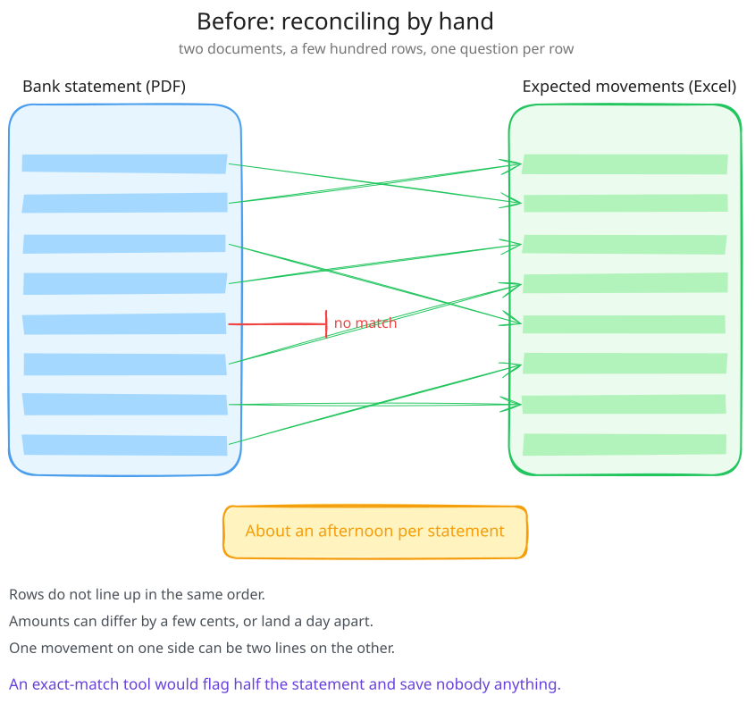
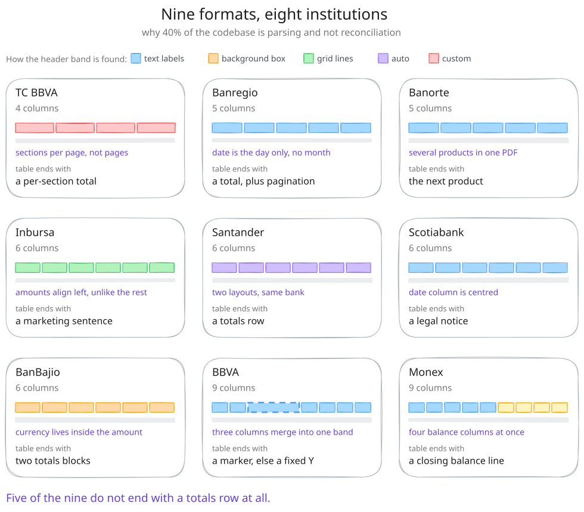
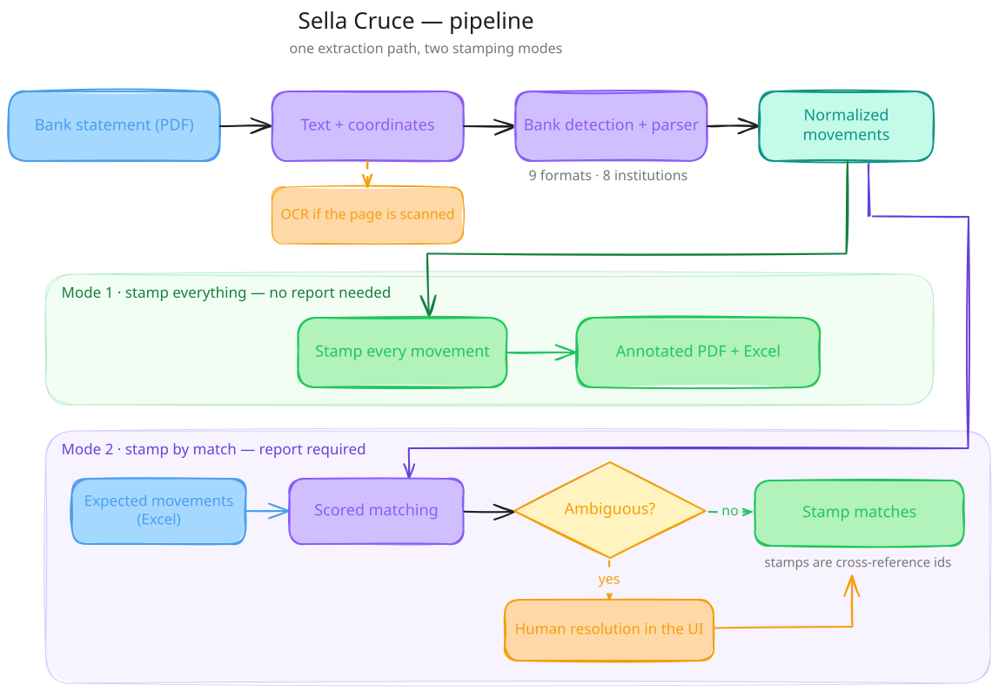
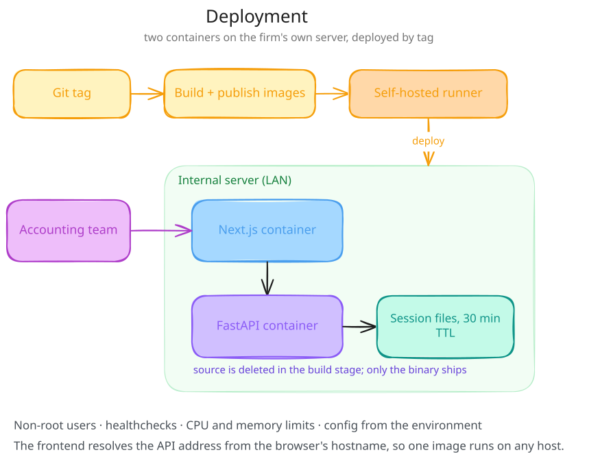

# Sella Cruce

Conciliación bancaria para una firma contable mexicana. Lee un estado de cuenta en PDF, cruza cada
movimiento contra un Excel de movimientos esperados, sella el PDF anotado y devuelve las excepciones
que todavía tiene que decidir una persona.

Lo construí como único desarrollador de la firma, de los requerimientos a producción, entre julio de
2025 y julio de 2026.

*[English](README.md) · Español*

**El código es cerrado** — pertenece a la firma y procesa datos financieros de sus clientes. Este
repositorio documenta la ingeniería: el problema, las decisiones y lo que costaron.

---

## El problema

Antes de que esto existiera, conciliar era una persona con dos documentos abiertos.

De un lado, un estado de cuenta en PDF: un mes de movimientos, cada uno con su fecha, su monto, su
referencia y una descripción escrita como ese banco en particular escribe descripciones. Del otro, un
Excel con los movimientos que los registros de la firma decían que *deberían* estar ahí.

El trabajo era ir línea por línea y responder una pregunta por cada fila: ¿este movimiento está en
los dos lados? Cuando sí, marcabas el PDF. Cuando no, lo señalabas. Un estado de cuenta con unos
cientos de movimientos tomaba una tarde, y el trabajo era atención pura — ningún juicio hasta que
algo no cuadraba, y para entonces ya habías gastado la atención en las trescientas filas que sí.

Dos cosas lo hacían peor de lo que suena.

**Los montos no cuadran limpio.** La misma transacción puede diferir por unos centavos entre el banco
y los libros, caer en otro día, o aparecer como una fila en el Excel y como dos en el estado de
cuenta. Una herramienta de match exacto marcaría la mitad del estado de cuenta como excepción y no le
ahorraría nada a nadie.

**Cada banco maqueta su PDF distinto.** No un poco — estructuralmente. El encabezado en otro lugar,
las columnas en otro orden, el saldo corriente incluido o no, las fechas en otro formato, los totales
en otra posición. No hay estándar. Y ni siquiera es una maqueta por banco: la misma institución
publica una maqueta completamente distinta para un estado de cuenta de tarjeta de crédito que para
uno de cheques.

Ese último punto es la forma entera del proyecto. Es la razón de que cerca del 40% del código sea
parsing y no conciliación.

---

## Qué hace

Nueve parsers que cubren ocho instituciones. Cada uno es una carpeta con su propio módulo y su propia
configuración declarativa; agregar un formato es agregar una carpeta, no tocar el core.

Hay tres puntos de entrada que comparten esas etapas: conciliación completa contra un Excel, una
pasada sobre todo el estado de cuenta sin Excel, y una exportación simple de los movimientos
parseados a CSV o XLSX.

---

## Decisiones, y lo que costaron

### La herramienta tiene dos modos porque el diseño cambió a la mitad

La primera versión sellaba indiscriminadamente: le dabas un estado de cuenta, le decías el banco y la
moneda, y encontraba todos los movimientos del tipo pedido y los marcaba. Sin libros de por medio.

Eso era útil e insuficiente. Marcar todos los movimientos te dice lo que dice el banco; no te dice si
tus libros coinciden. Así que la segunda versión tomó el reporte de movimientos esperados como
entrada y selló por coincidencia — misma extracción, otra pregunta.

Lo que no esperaba es que el primer modo nunca quedó obsoleto. Sellar todo es la herramienta correcta
cuando quieres un estado de cuenta anotado y limpio y no tienes un reporte contra el cual conciliar,
y el equipo lo siguió usando. Los dos modos salieron y los dos se quedaron.

**Costo:** dos caminos de conciliación que mantener, que comparten la extracción pero divergen
después de ella. El camino de cruce específico es donde se concentró la complejidad, y es el módulo
que terminó creciendo demasiado.

### Los sellos son referencias cruzadas, no palomitas

Un movimiento cruzado no recibe una palomita. Recibe un identificador que ata esa línea del PDF con
su contraparte en el reporte, de modo que el estado de cuenta anotado se navega solo: un auditor con
el PDF sellado en la mano puede rastrear cualquier línea marcada sin tener enfrente la hoja de
cálculo original.

Ese requisito es la razón de que el sellado sea un motor de verdad y no una llamada de dibujo — tiene
que encontrar el monto en la página, encontrar espacio libre cerca que no choque con el contenido
existente, y colocar ahí la anotación.

### La ambigüedad es una etapa del pipeline, no un error

El matcher puntúa candidatos y produce tres resultados: coincidencia confiable, sin coincidencia, o
grupo ambiguo. Al principio, ambiguo significaba fallo — la corrida se detenía y una persona
empezaba de nuevo a mano.

Ese era el modelo equivocado. La ambigüedad es el estado normal de este problema, no una excepción, así
que la convertí en una etapa: los grupos ambiguos viajan de vuelta a la UI, el usuario elige, y el
resultado se reensambla del lado del servidor y sigue hacia el sellado.

**Costo:** el pipeline dejó de ser una sola pasada. El estado tiene que sobrevivir un viaje redondo a
través de una persona, que es de donde sale casi todo el manejo de sesiones de abajo.

### Las sesiones de archivos viven en el servidor

La primera versión pasaba los archivos al navegador en base64 y los guardaba en `sessionStorage`.
Funcionó hasta que un estado de cuenta real rebasó la cuota de almacenamiento y la pestaña perdió el
documento en silencio.

Ahora los archivos viven en un directorio de sesión del lado del servidor, con clave UUID, TTL de 30
minutos y limpieza de sesiones vencidas al arrancar la API. El navegador guarda un ID, no un
documento.

**Costo:** la API ahora es dueña de archivos temporales y de su ciclo de vida, que es una clase de
bug que solo aparece cuando algo lleva semanas corriendo.

### Un parser y un archivo de configuración por formato, descubiertos en tiempo de ejecución

El core no sabe qué bancos existen. Escanea el directorio de parsers y carga lo que encuentra, así
que dar de alta una maqueta nueva es agregar una carpeta.

También hay un camino para estados de cuenta cuyo formato todavía no tiene parser: en vez de fallar,
la corrida cae a selección manual de banco para que un usuario pueda empujar el documento por las
partes del pipeline que no dependen de la maqueta.

**Costo, y este sí me mordió:** una tabla de alias aparte maneja la detección de banco a partir del
texto del PDF, y se desincronizó de las carpetas de parsers — lista una institución sin parser y
omite dos que sí lo tienen. Dos fuentes de verdad para el mismo dato, que es exactamente el modo de
fallo que este diseño debía evitar. El registro debió derivarse de las carpetas, no mantenerse al
lado de ellas.

### El OCR decide por página, no por documento

Las páginas escaneadas pasan por OCR; las digitales no. La revisión corre página por página y la capa
de OCR se mezcla con la digital, deduplicada por traslape de bounding boxes.

La razón es que los estados de cuenta reales son mixtos — un PDF digital con un inserto escaneado.
Decidir a nivel de documento significa o pasar por OCR páginas limpias, que es lento y pierde
precisión, o saltarse una página que lo necesitaba.

### Los montos son `Decimal`, nunca `float`

No negociable en software contable, y barato si lo decides el primer día en vez de andar cazando
desviaciones de redondeo después.

### La aplicación se distribuye como binario compilado

La imagen de la API se construye en varias etapas: compilar a bytecode, empaquetar con PyInstaller,
borrar el fuente, y copiar solo el binario a un runtime ligero.

La razón es que corre en el servidor de la propia firma, y el fuente es el activo.

**Costo:** los builds se volvieron lentos, y depurar producción se puso bastante más difícil — un
stack trace de un binario congelado te dice menos que uno con fuente. Si tuviera que elegir otra vez
para un sistema de este tamaño, querría una respuesta más clara sobre si el intercambio valió la
pena.

### Los errores son códigos, no cadenas

Cerca de una docena de códigos de error estructurados compartidos entre API y frontend, para que un
fallo diga *banco no detectado* o *no hay espacio para sellar cerca de este monto* en vez de *algo
salió mal*. Los usuarios de una herramienta interna pueden actuar sobre lo primero; sobre lo segundo
levantan un ticket.

---

## Stack y despliegue

**Backend:** Python, FastAPI, pandas, Tesseract para OCR. 17 endpoints HTTP funcionales repartidos
entre los módulos de procesamiento, exportación y sesiones.

**Frontend:** Next.js con App Router, TypeScript, React.

**Despliegue:** dos contenedores en un servidor interno. Usuarios non-root, healthchecks, límites de
CPU y memoria, configuración por entorno, allowlist de CORS sin comodín en producción.

**CI/CD:** cuatro workflows de GitHub Actions — pruebas en matriz, releases etiquetados que publican
las imágenes construidas, auto-despliegue a través de un runner self-hosted en el servidor, y uno que
rompe el build cuando cambia el código y no la documentación.

El frontend resuelve la dirección de la API desde el hostname del propio navegador en vez de una
variable horneada en el build, así que una sola imagen corre en cualquier host sin recompilar.

---

## Hasta dónde llegó

- **9 formatos** de estado de cuenta, de 8 instituciones.
- **~30,000 líneas de Python**, cerca del 40% parsing y 22% pruebas.
- **3–5 usuarios diarios:** un equipo base de tres, a veces cuatro, más otros equipos que lo
  adoptaron por su cuenta. Semanas pesadas en los periodos de devolución de IVA.
- **5 releases etiquetados.** Primer build empaquetado en noviembre de 2025; stack formal de
  producción en marzo de 2026.
- Un desarrollador, de principio a fin.

---

## Qué haría distinto

**Derivar el registro de bancos del sistema de archivos.** La desincronización descrita arriba era
predecible desde el momento en que escribí la segunda fuente de verdad.

**Partir el módulo de conciliación antes.** El módulo de cruce específico pasó de las 1,700 líneas
porque cada caso nuevo tenía un lugar obvio dentro de él. Hubo un punto en el que debió volverse tres
módulos y me lo pasé de largo sin notarlo.

**Decidir el modelo de distribución antes de construir alrededor de él.** Compilar a binario le dio
forma al Dockerfile, al CI y a la historia de depuración. Fue una decisión razonable, pero la tomé a
medio camino en vez de al principio, y hubo que rehacer todo el pipeline de build para acomodarla.

---

## Sobre el código cerrado

El código es propiedad de la firma que lo encargó, y procesa documentos financieros de sus clientes.
Este repositorio describe la ingeniería sin reproducir el sistema: sin reglas de parsing, sin
umbrales de cruce, sin configuración, sin datos de clientes. Las capturas usan datos inventados.

Con gusto platico cualquier parte con más detalle.
